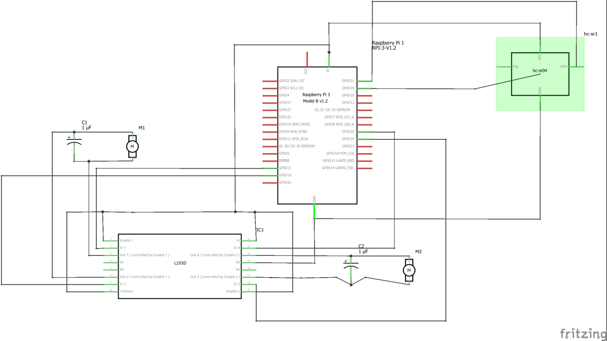

# Self-Driving-Car
Contributers: guptayash and ayushkul2910

INTRODUCTION
In this project, we are implementing a self-driven car using Raspberry-Pi. Raspberry-Pi being portable and having powerful processor can be considered as best micro-controller for this project.
There are three basic modules associated with the processing part: -

 First module is the obstruction detection using Ultrasonic Sensor.

 Second module is stop sign detection.

 Third module is lane detection.
Our main motive is to let the car be driven on its own using the above mentioned features. Ultrasonic Sensor detects if an object is in front of the car. Stop sign conveys when to stop. Lane detection let the car to be driven in a proper lane.

Self-driven car is a project based on Computer Vision, Artificial Intelligence and neural networks. Raspberry-Pi takes the input in the form of images (frames) fed by a wireless camera fitted on top of the car. Then these images (frames) are processed to extract the desired features. The features are then processed to get the lane and detect stop sign. The stop sign is detected using an xml file generated by haar classifier which is discussed later in detail. Ultrasonic Sensor on the other hand, detects the obstruction in front of the car.

REQUIREMENTS

HARDWARE REQUIREMENTS
• Raspberry PI
• Camera
• Memory Card for storage
• Ultrasonic Sensor for obstruction detection
• Breadboard
• Jumper Wires
• Motors
• Battery (for external power)
• Relay
• Resistors (if needed)
• Car, Traffic Signs

SOFTWARE REQUIREMENTS
• Raspbian Jessie OS for Raspberry Pi
• IP WEBCAM App for connecting Android mobile as camera
• Python 3.4 – 32bit
• OpenCV module in python for image processing
• Haar cascades for creating a database of traffic signs using neural networks

METHODOLOGY
1. Ultrasonic Sensor Module
The car is fitted with an Ultrasonic Sensor. This Sensor contains 4 pins: Trigger, Echo, Ground and Power. Once the sensor is powered, the trigger pin prompts the sensor to continuously send the ultrasonic waves. These waves on returning powers the echo pin and the distance is thus measured. Thus, continuously powering the sensors returns the distance in front of the car. If an obstruction is very near (say 10cm), the sensor detects the distance and stops the car.

2. Camera and Imaging Module
An android phone is used as a camera using the app IP WEBCAM. This app wirelessly sends the images of the phone’s camera to a webpage, which can be easily extracted in the python using library ‘urllib’. These images are processed to reduce background noises.

3. Stop Detection Module
For detecting the stop signs, a Haar cascade has to be made. This can be achieved using neural networks. For this a number (10000) of negative images (which does not have stop sign in it) are superimposed with few positive images (~10 images). Thus creating a very large database or cascade. The cascade used in our project is trained up to 20 stages. After completion, this creates an XML file which can be used in python. Distance from the stop sign is calculated using triangular similarity algorithm.

4. Lane Detection Module
As soon as the image is fed to the processor, the noise is reduced by using Gaussian blur filters and canny edge extraction. For detecting the lanes, Hough transform is used which detects the straight lines, thus the straight lanes are detected. Now, the average of these lanes is calculated and the car is forced to move about this average line. If the car diverts to left or right, the average shifts and car is forced to turn in other direction.
These all modules are integrated in a single piece of code, without compromising the processing time and the reaction time of the car.

SCREENSHOTS:-

